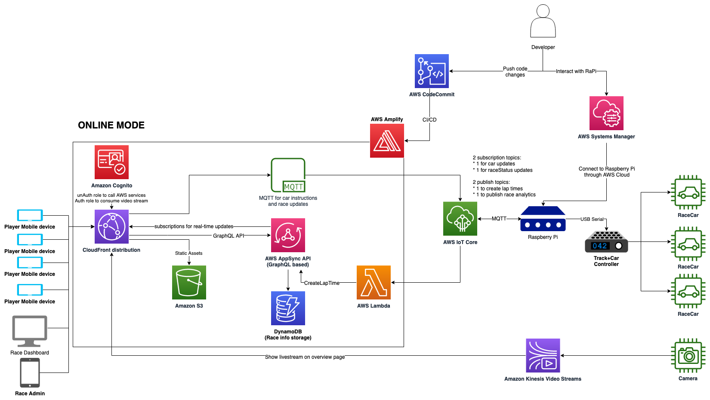

# Scalextric Race Manager v2.0

This project is the v2.0 of the [2022 re:Invent Scalextric race car project](https://github.com/aws-samples/realtime-slot-car-racing-with-aws-amplify-aws-iot-core-and-amazon-kinesis-video-streams).  

## Architecture Diagram

The architecture is basically tha same as the previous version, however the race helper utility has been refactored to a self-contained race manager program that can run on a Raspberry Pi or as a container in AWS.

## Class Hierarcy

The UML for the class diagram is found here.  The CEventManager uses a Facade pattern to simply the car, driver, control events and laptime management.  The GameFacade allows you to drive the EventManager using SQS, MQTT or Local API calls, so you can build your UX for local or Cloud distribution.  With CLoud distribution, it is possible to have remote players interacting witht he game through mobile device and the video feed.

## Sequence Diagram

The eimplified UML sequence diagram for the code is found here.  The main.py is a convenience script for testing the CEventManager.  You should build your own UX to interact with the CEventManager.  

